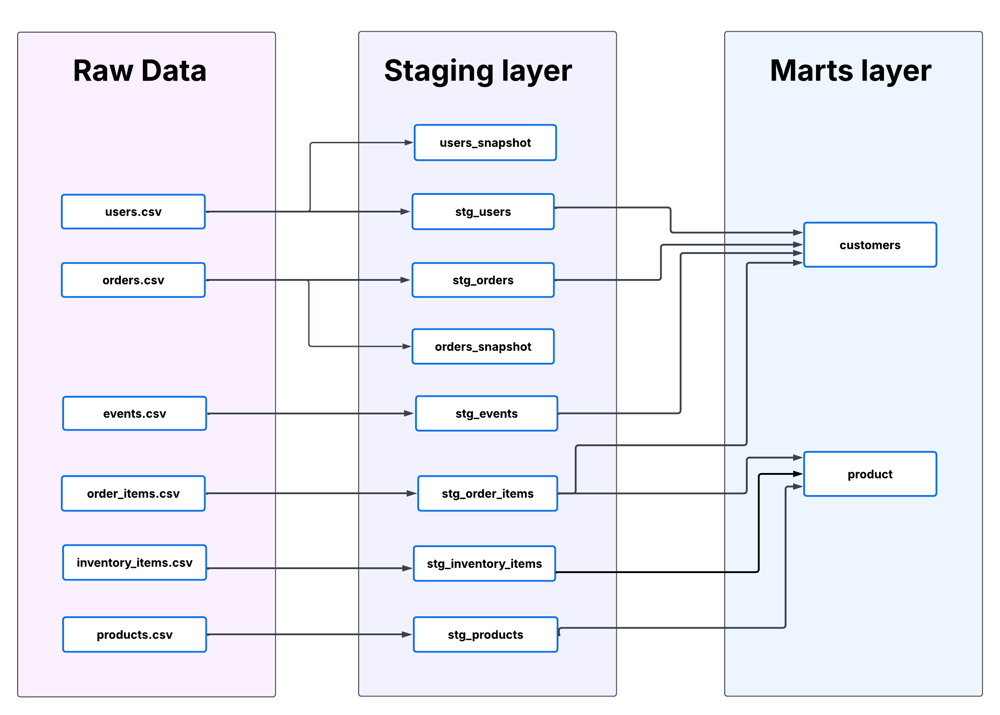
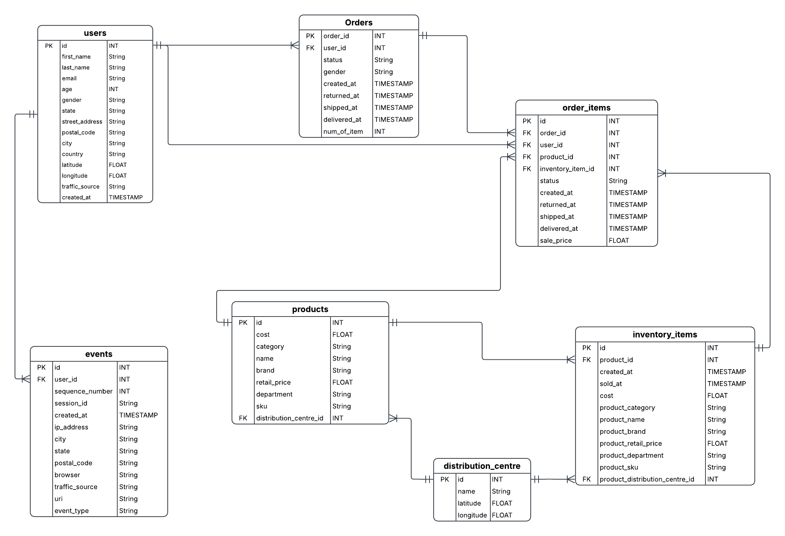
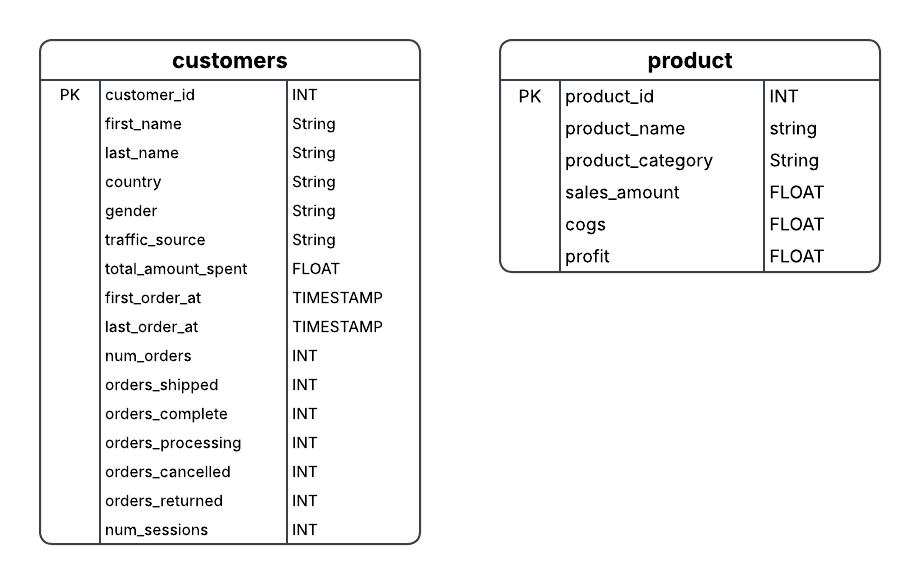

# E-Commerce Analytics Pipeline with dbt

An end-to-end dbt project that transforms raw e-commerce data into analytics-ready models using staging, snapshots, testing, and documentation.

---

- [Project Overview](#project-overview)
- [Tech Stack](#tech-stack)
- [Project Architecture](#project-architecture)
- [Data Model](#data-model)
- [Loading the Data](#loading-the-data)
- [Staging Layer](#staging-layer)
- [Mart Models](#mart-models)
  - [Customers](#customers)
  - [Product](#product)
- [Snapshots](#snapshots)
- [Data Quality](#data-quality)
  - [Generic Tests](#generic-tests)
  - [Custom Generic Test](#custom-generic-test)
  - [Singular Tests](#singular-tests)
- [Project Structure](#project-structure)

---

## Project Overview

This project builds a data pipeline for an e-commerce dataset using **dbt**.

The raw data is provided as CSV files and represents data such as customers, products, orders, inventory, and website events. The goal is to transform these raw datasets into clean, documented, and tested analytical models that can answer business questions about customers and products.

The dataset used in this project comes from the Kaggle **Ecommerce BigQuery Dataset**.

Dataset:
https://www.kaggle.com/datasets/chiraggivan82/ecommerce-bigquery

## Tech Stack

- dbt Core
- DuckDB
- SQL
- Jinja
- Git
- GitHub

## Project Architecture

The project follows this dbt workflow:



Raw CSV files are first loaded into DuckDB. Then dbt builds staging models before creating marts and snapshots to track history.

## Entity Relationship Diagram

The source dataset contains customer, order, inventory, product and event information.

The following diagram shows the relationships between the different tables.



## Loading the Data

The dataset is distributed as CSV files.

Since the `distribution_centers.csv` file contains only **10 rows** and its data is slow changing, it is loaded as a **dbt seed**.

The remaining datasets are significantly larger and fast changing therefore they are first loaded into **DuckDB**, where they are defined as dbt **sources**.

### Why DuckDB?

It is lightweight, requires no server setup, and integrates well with dbt.

## Staging Layer

The staging layer provides a clean interface over the raw source tables.

At this stage:
- documentation is added through `schema.yml`
- source definitions are maintained in `sources.yml`

## Mart Models

Two analytical marts were created:

- Customers
- Product



These marts are designed to answer common business questions while providing clean datasets for reporting.

### Customers

**Grain :** One row per customer.

The model combines customer information with order history and session activity to provide customer-level metrics.

### Product

**Grain :** One row per product.

The model aggregates sales information at the product level.

## Snapshots

Two snapshots were created to preserve historical changes.

### Orders Snapshot

Tracks changes in the order status.

Whenever an order status changes, dbt records a new version of that row.

### Users Snapshot

Tracks changes in customer profile information.

The following attributes are monitored:

- email
- state
- street_address
- postal_code
- city
- country
- latitude
- longitude

Whenever one of these attributes changes, a new version of the customer record is created.

## Data Quality

The project includes both generic and custom tests to ensure data quality.

### Generic Tests

The following dbt tests are used:

- unique
- not_null
- accepted_values
- relationships

These tests validate primary keys, mandatory fields, valid categorical values (acceptd values), and referential integrity between models (relationships).

### Custom Generic Test

A reusable generic test called `non_negative` was implemented using a dbt macro.

It validates that numerical metrics such as totals and sales values are never negative.

### Singular Tests

Business rules are validated using singular SQL tests stored in the `/tests` directory.

Examples include:

- customer age must be between 0 and 110
- product cost cannot exceed retail price
- delivered orders cannot be delivered before they are shipped
- profit must equal sales amount minus cost of goods sold


---

# Project Structure

```text
.
├── analyses/
├── data /     # CSV files
├── macros/
├── models/
│   ├── staging/
│   ├── marts/
├── seeds/
├── snapshots/
├── tests/
├── dbt_project.yml
├── dev.duckdb   # The Database where all tables and views are stored
|── load_data.py  #To load the source data into DuckDB.
└── README.md